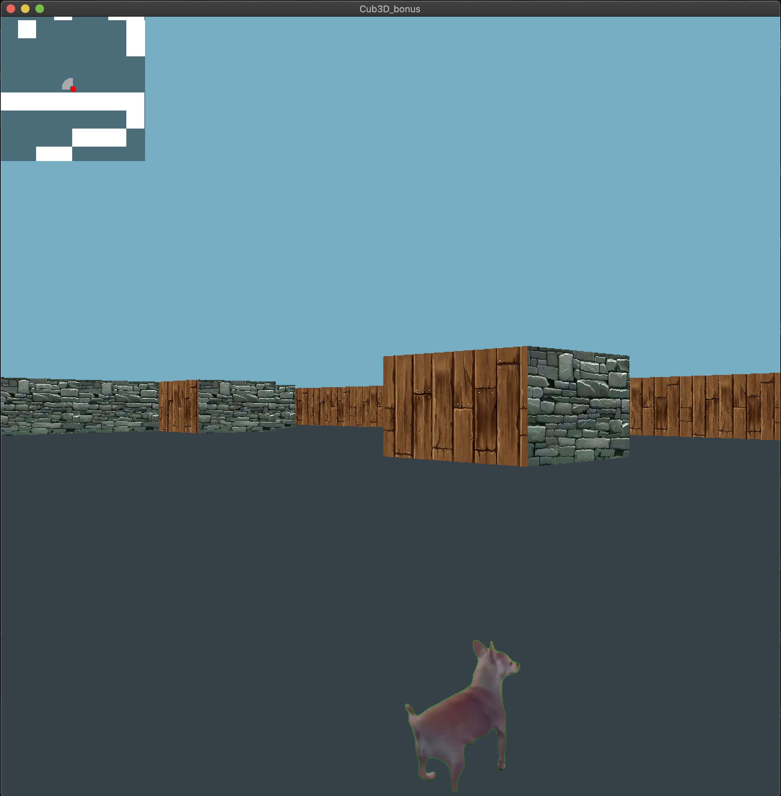
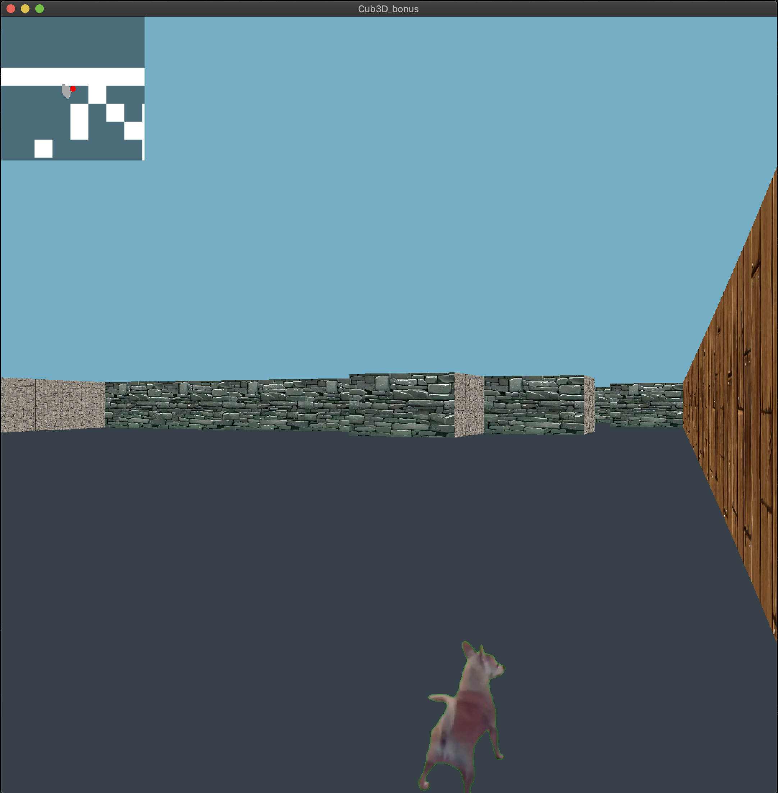
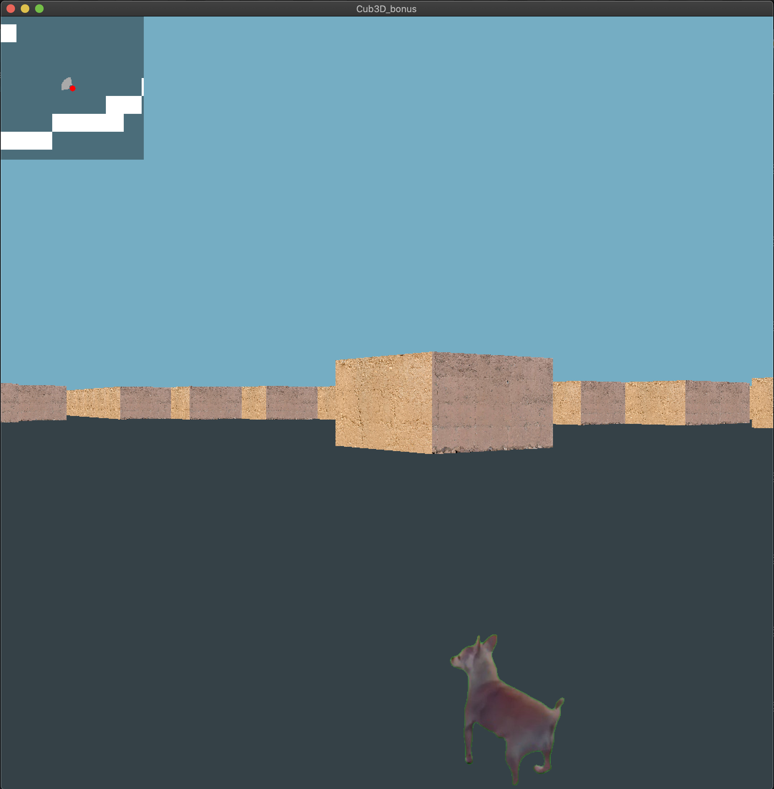

# cub3D

**cub3D** is a 3D game project created in C using the [MLX42](https://github.com/codam-coding-college/MLX42) library and implements ray casting to render a simple first-person view. This project is part of the 42 School curriculum, and it introduces basic concepts of 3D graphics rendering, game development, and computational geometry.

## Table of Contents
- [Introduction](#introduction)
- [Features](#features)
- [Installation](#installation)
- [Controls](#controls)
- [Screenshots](#screenshots)

## Introduction
cub3D is inspired by classic 90s games like Wolfenstein 3D, providing a simplified 3D environment rendered from a first-person perspective. The project demonstrates how to create a game engine using only C and the MLX42 framework while implementing ray casting to simulate 3D views from a 2D map.

## Features
- **3D Rendering**: A basic 3D engine based on ray casting that allows the player to explore a simple world.
- **Customizable Maps**: Load different map layouts using .cub files.
- **Basic Player Movement**: Move around the environment using the keyboard.
- **Interactive Elements**: Wall collisions and dynamic interaction with the world.
- **MLX42 Framework**: Utilizes the MLX42 library for rendering graphics and handling inputs.

## Installation
To build and run the project, follow these steps:

1. Clone the repository:
   ```bash
   git clone git@github.com:oumimoun/cub3D_42.git
   cd cub3D_42
   ```

2. Install dependencies for MLX42:
   ```bash
   brew install cmake glfw
   ```

3. Build the project using the provided Makefile:
   ```bash
   make
   ```

4. Run the game:
   ```bash
   ./cub3D maps/map.cub
   ```

## Controls
- **W** / **A** / **S** / **D**: Move forward, left, backward, and right.
- **Left / Right Arrow**: Rotate the view.
- **ESC**: Quit the game.

## Screenshots



